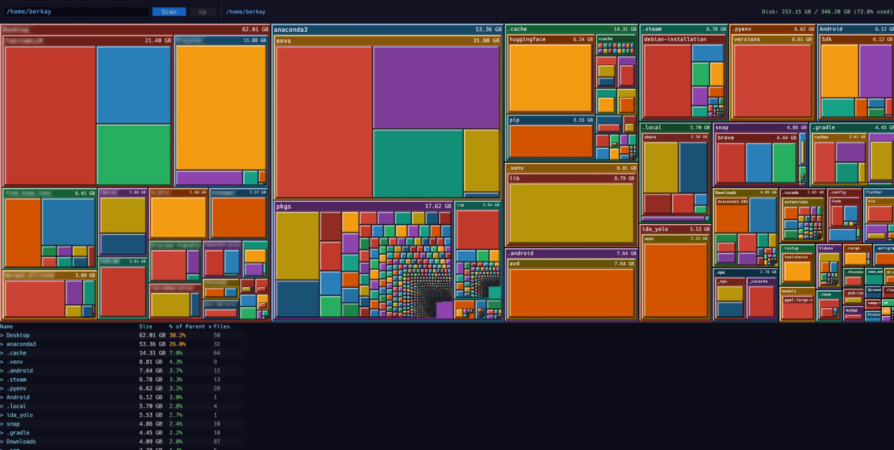

# DiskScout

A disk space analyzer for Linux, written in Rust.



## Features

- Parallel filesystem scanning using jwalk and rayon (up to 12x faster than single-threaded)
- Squarified treemap with recursive visualization
- Header strips with folder names and sizes
- Resizable file list panel with sortable columns
- Hover tooltips showing folder contents
- Click to navigate into directories, Up button to go back
- Dark theme with 3D bevel blocks

## Performance

Scanned 2 million files in 1.4 seconds on a standard laptop.

## Install

**Ubuntu / Debian / Mint — one-liner:**
```bash
curl -LO https://github.com/RudblestThe2nd/DiscScout/releases/latest/download/diskscout_0.1.0_amd64.deb && sudo dpkg -i diskscout_0.1.0_amd64.deb
```

Or download the `.deb` from the [Releases](https://github.com/RudblestThe2nd/DiscScout/releases) page.

**Other distros:**
```bash
bash <(curl -s https://github.com/RudblestThe2nd/DiscScout/releases/latest/download/install.sh)
```

## Build from Source

**Requirements:** Linux, Rust 1.70+

```bash
cargo build --release
./target/release/diskscout
```

## Usage

```bash
# Launch UI
./target/release/diskscout

# Scan a specific directory on startup
./target/release/diskscout /home
```

## Keyboard Shortcuts

| Action | How |
|---|---|
| Scan directory | Click Scan or type path |
| Go up one level | Click Up button |
| Navigate into folder | Click on treemap block |

## Architecture

| Layer | Technology | Purpose |
|---|---|---|
| Scanner | jwalk + rayon | Parallel filesystem traversal |
| Tree | Arena (Vec<Node>) | Memory-efficient node storage |
| Layout | Squarify algorithm | Treemap rectangle computation |
| UI | egui + eframe | GPU-accelerated rendering |

## License

MIT
